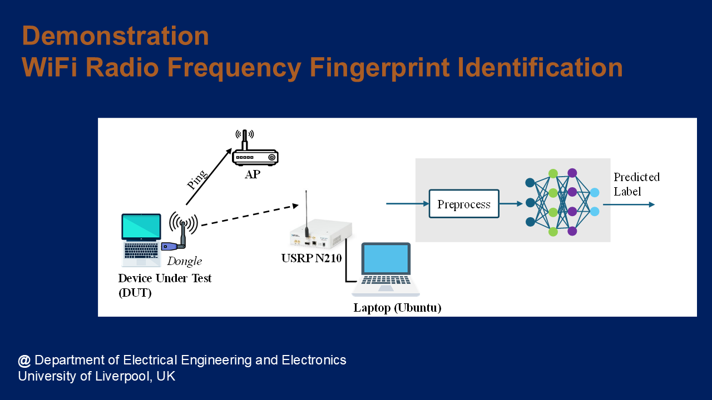



## Overview
* Funder: EPSRC
* Duration: July 2024 to March 2025
* Amount: £331k (Total). Liverpool share: £128k
* Partner: Heriot Watt University and Queen’s University Belfast

This project was awarded under [EPSRC Federated Telecoms Hub 6G Research Partnership Funds (THRPF)](https://www.federated-telecoms-hubs.org/), as a collaborative project with [HASC: Future
Communications Hub in All-Spectrum Connectivity](https://allspectrumhub.org/). 

## Introduction
Wireless communications have brought revolutionary transformation to our everyday lives, industry, etc, achieved by ubiquitous connectivity of massive wireless devices (21.7 billion in 2024) and exciting applications, e.g., smart homes, connected healthcare, autonomous driving, etc. The wireless infrastructure is traditionally protected by cryptography, which, however, faces difficulties to be applied to devices where cost and accessibility are limiting factors.

Radio frequency fingerprinting identification (RFFI) is an emerging non-cryptographic and physical-layer security technique to secure existing and future telecommunication infrastructure. It exploits unique and intrinsic hardware fingerprints of RF components for device identification, which does not rely on cryptography. Its implementation does not require any change to the transmitters and can be readily applied to existing and future radio communication systems. 

## Demo
Please visit [Wi-Fi RFFI @ University of Liverpool](/research-demo/demo-wifi-rffi/) for a detailed introduction of our demo.

Click the image below to watch the demo video.

## Outcome

