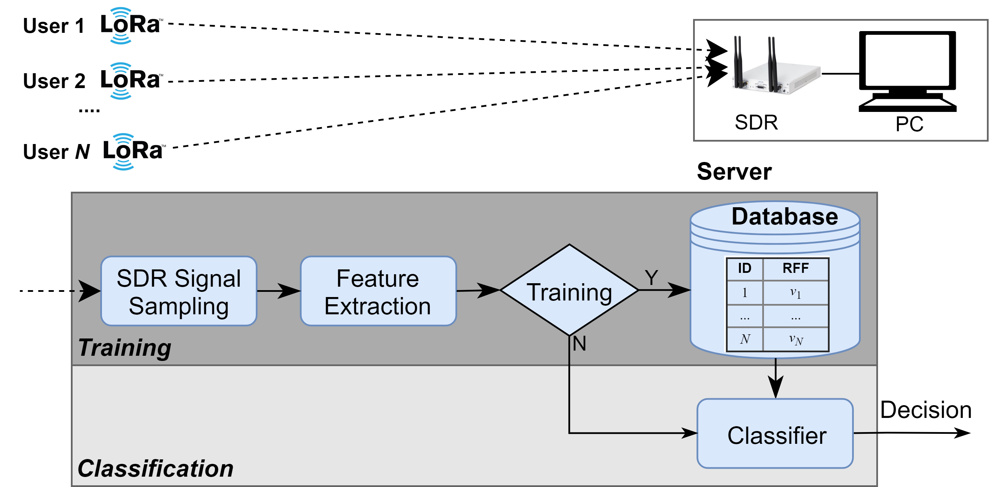

 

# Overview
* Funder: Royal Society Research Grants
* Duration: March 2019 to March 2020
* Amount: £19k

# Introduction
Low power wide area network (LPWAN) is a key enabler of the Internet of Things (IoT) to connect sensors cheaply and reliably for smart manufacturing, agriculture, healthcare, etc. McKinsey estimated that LPWAN would deliver £19.2b to £57.6b for the UK by 2025. LoRa is a key technology for the LPWAN with 0.6 billion devices estimated by 2023. The UK is ambitious to build a national LoRa network. 

The wireless security is vital because the exchanged data may be confidential. In particular, device authentication is very essential for allowing the legitimate users to access the network but more important for rejecting the malicious attackers. Conventional schemes use device address such as MAC address which can be easily tampered even by amateurs. This is even worse for LoRa because many LoRa sensors are low cost with limited resources. On the other hand, a LoRa gateway (base station) can connect thousands of end devices and access of malicious users may compromise the entire LoRa network.

This project aims to design a robust device authentication scheme by exploiting the radio frequency fingerprinting (RFF). RFF is intrinsic hardware imperfection resulted from the manufacturing process, which is unique and cannot be tampered. Therefore, it is a good candidate for device identity.

# Methodology
RFF identification is consisted of two stages, namely the training and classification.
 
<figure>
  
  <figcaption>RFF identification for LoRa </figcaption>
</figure>

# Outcome
Supported by this Research Grants, our group has equipped with LoRa devices from different vendors (Pycom FiPy and LoPy4, Semtech kits) and software defined radio (SDR) platforms (including USRP N210, PlutoSDR, RTLSDR, etc). We have built LoRa-RFFI testbed and achieved fruitful outcomes.

## Publication
1. Guanxiong Shen, **Junqing Zhang***, Alan Marshall, Roger Woods, Joseph Cavallaro, and Liquan Chen, “Towards Receiver-Agnostic and Collaborative Radio Frequency Fingerprint Identification”, _IEEE Transactions on Mobile Computing_, vol. 23, no. 7, pp. 7618 - 7634, Jul. 2024. [IEEE](https://ieeexplore.ieee.org/document/10345732){:target="_blank"}, [arXiv link](https://arxiv.org/abs/2207.02999){:target="_blank"}
1. Guanxiong Shen, **Junqing Zhang***, Alan Marshall, Mikko Valkama, and Joseph Cavallaro, “Towards Length-Versatile and Noise-Robust Radio Frequency Fingerprint Identification,” _IEEE Transactions on Information Forensics and Security_, vol. 18, pp. 2355 - 2367, Apr. 2023. [IEEE](https://ieeexplore.ieee.org/document/10100932){:target="_blank"}, [arXiv link](https://arxiv.org/abs/2207.03001){:target="_blank"}
1. Guanxiong Shen, **Junqing Zhang***, Alan Marshall, and Joseph Cavallaro, “Towards Scalable and Channel-Robust Radio Frequency Fingerprint Identification for LoRa,” _IEEE Transactions on Information Forensics and Security_, vol. 17, pp. 774 - 787, Feb. 2022. [link](https://ieeexplore.ieee.org/abstract/document/9715147){:target="_blank"}
1. Guanxiong Shen, **Junqing Zhang***, Alan Marshall, Linning Peng, and Xianbin Wang, “Radio Frequency Fingerprint Identification for LoRa Using Deep Learning,” _IEEE Journal on Selected Areas in Communications_, vol. 39, no. 8, pp. 2604 - 2616, Aug. 2021. [link](https://ieeexplore.ieee.org/document/9448147){:target="_blank"}
1. Guanxiong Shen, **Junqing Zhang***, Alan Marshall, Linning Peng, and Xianbin Wang, “Radio Frequency Fingerprint Identification for LoRa Using Spectrogram and CNN,” in _Proc. IEEE INFOCOM_, 2021. [link](https://arxiv.org/abs/2101.01668){:target="_blank"}

## Datasets and Codes
The datasets and codes of the following papers are publicly available.

1. Guanxiong Shen, **Junqing Zhang**, Xuyu Wang, and Shiwen Mao, “Federated Radio Frequency Fingerprint Identification Powered by Unsupervised Contrastive Learning,” _IEEE Transactions on Information Forensics and Security_, vol. 19, pp. 9204-9215, 2024. [link](https://ieeexplore.ieee.org/document/10697226){:target="_blank"}
* [Dataset: LoRa Federated RFFI](https://ieee-dataport.org/documents/lorafederatedrffidataset){:target="_blank"}
* [LoRa Federated RFFI](https://github.com/gxhen/federatedRFFI){:target="_blank"}

1. Guanxiong Shen, **Junqing Zhang***, Alan Marshall, Roger Woods, Joseph Cavallaro, and Liquan Chen, “Towards Receiver-Agnostic and Collaborative Radio Frequency Fingerprint Identification”, _IEEE Transactions on Mobile Computing_, vol. 23, no. 7, pp. 7618 - 7634, Jul. 2024. [IEEE](https://ieeexplore.ieee.org/document/10345732){:target="_blank"}, [arXiv link](https://arxiv.org/abs/2207.02999){:target="_blank"}
* [Dataset: Radio Frequency Fingerprint LoRa Dataset Multiple Receivers](https://ieee-dataport.org/documents/radio-frequency-fingerprint-lora-dataset-multiple-receivers){:target="_blank"}
* [Code: Radio Frequency Fingerprint LoRa Dataset Multiple Receivers](https://github.com/gxhen/receiverAgnosticRFFI){:target="_blank"}

1. Guanxiong Shen, **Junqing Zhang***, Alan Marshall, Mikko Valkama, and Joseph Cavallaro, “Towards Length-Versatile and Noise-Robust Radio Frequency Fingerprint Identification,” _IEEE Transactions on Information Forensics and Security_, vol. 18, pp. 2355 - 2367, Apr. 2023. [IEEE](https://ieeexplore.ieee.org/document/10100932){:target="_blank"}, [arXiv link](https://arxiv.org/abs/2207.03001){:target="_blank"}
* [Dataset: LoRa RFFI with Different Spreading Factors](https://ieee-dataport.org/documents/lorarffidatasetdifferentspreadingfactors){:target="_blank"}
* [Code: LoRa RFFI with Different Spreading Factors](https://github.com/gxhen/lengthVersatileRFFI){:target="_blank"}

1. Guanxiong Shen, **Junqing Zhang***, Alan Marshall, and Joseph Cavallaro, “Towards Scalable and Channel-Robust Radio Frequency Fingerprint Identification for LoRa,” _IEEE Transactions on Information Forensics and Security_, vol. 17, pp. 774 - 787, Feb. 2022. [IEEE](https://ieeexplore.ieee.org/abstract/document/9715147){:target="_blank"}, [arXiv](https://arxiv.org/abs/2107.02867){:target="_blank"}
* [Dataset: LoRa RFFI](https://ieee-dataport.org/open-access/lorarffidataset){:target="_blank"}
* [Code: LoRa RFFI](https://github.com/gxhen/LoRa_RFFI){:target="_blank"}

