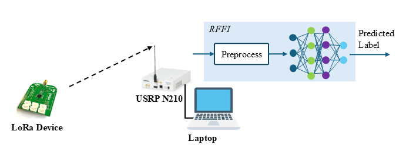
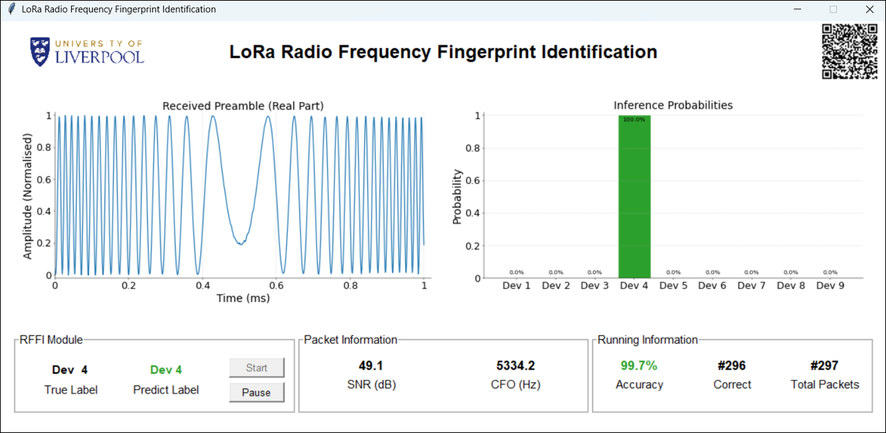

A Radio Frequency Fingerprint Identification (RFFI) LoRa demonstration has been developed at University of Liverpool, UK. 



# Overview

The following figure shows the setup.
 
 
 

# Hardware
* LoRa Device Under Test (DUT): 4* mbed1262 + 5* mbed1272 
* Receiver: Laptop + USRP N210
 
 
 
RFFI LoRa Demo Testbed

# Software
* LoRa Device: C language. Check https://os.mbed.com/components/SX1272MB2xAS/
* USRP N210 for Data collection: Matlab 
* Deep learning: Pytorch.
 
   
 

Return to the Main Page of [Radio Frequency Fingerprint Identification](/research/rffi/rffi_main_page/) or the Main Page of [Research Demonstration](/research-demo/research-demo-main-page/).
