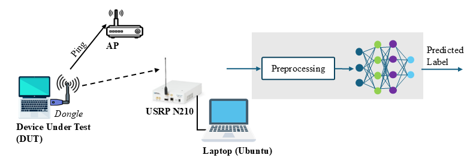
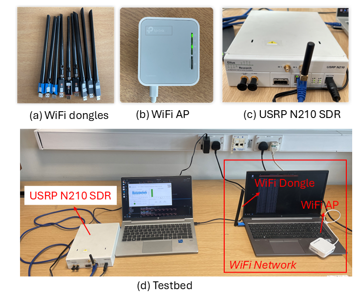
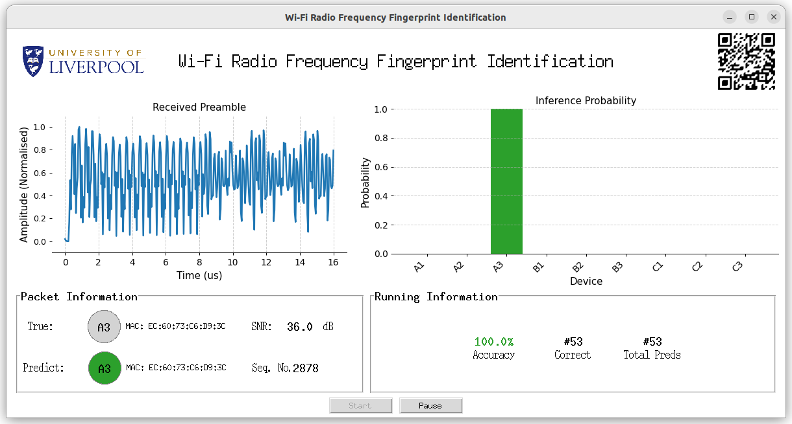
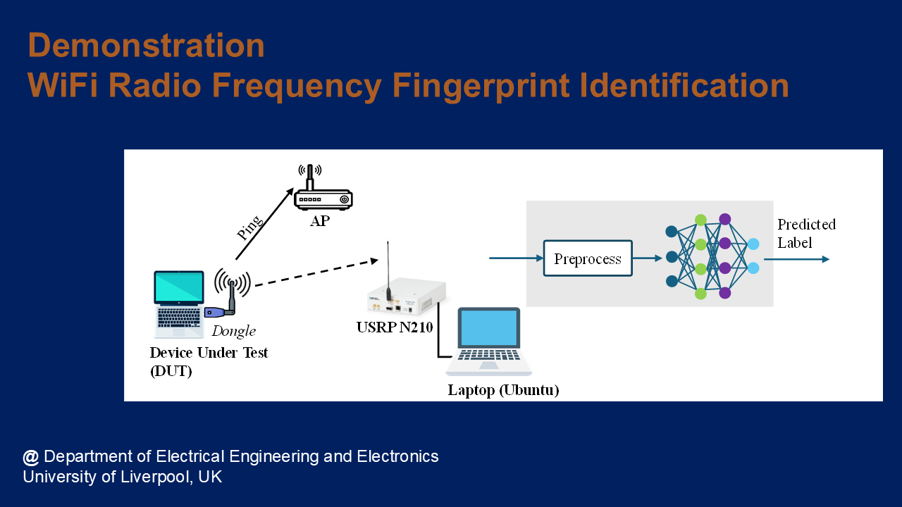

A Wi-Fi Radio Frequency Fingerprint Identification (RFFI) demonstration has been developed at University of Liverpool, UK. 



# Overview

The following figure shows the setup.
 
 
 

# Hardware
* Device Under Test (DUT), a laptop with a Wi-Fi dongle
* Access Point (AP): a TP-Link Wi-Fi router
* Monitor: Laptop + USRP N210
 
 
 
Wi-Fi RFFI Demo Testbed

# Software
* DUT (dongle): running ping
* AP: running in a normal AP mode
* Monitor: The laptop running [PicoScenes](https://ps.zpj.io/){:target="_blank"}  to access Wi-Fi signals. Deep learning is powered by Pytorch.
 
   
 

# Video
Click the image below to watch the video.

# Acknowledgement
This project was awarded under [EPSRC Federated Telecoms Hub 6G Research Partnership Funds (THRPF)](https://www.federated-telecoms-hubs.org/), as a collaborative project with [HASC: Future
Communications Hub in All-Spectrum Connectivity](https://allspectrumhub.org/). 

Return to the Main Page of [Radio Frequency Fingerprint Identification](/research/rffi/rffi_main_page/) or the Main Page of [Research Demonstration](/research-demo/research-demo-main-page/).
