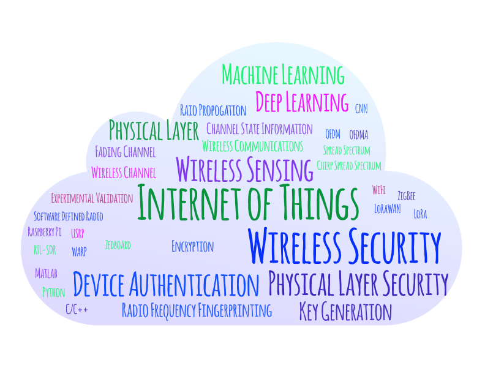
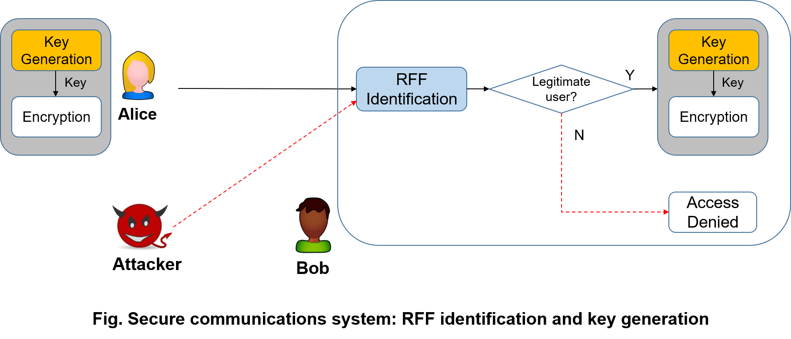

I have developed a strong research potential in innovative physical layer security solutions for future wireless technologies with ultra-low energy requirements but high security standards. My research aims to bridge the gap between the theoretical modelling and practical exploitation of physical layer security using state-of-the-art testbeds and equipment.



# Research Keywords

 

 

# Research Topics
My research aims to exploit the wireless channel for security and sensing. 

## 1. Wireless Security
Secure communication will be achieved by using key generation and device authentication. 

 

 

###  [1.1 Key Generation from Wireless Channels](/research/keygen/keygen_main_page/){:target="_blank"}
Key generation is an emerging technique to establish cryptographic keys between legitimate users by extracting randomness from their common channels.
* [Key Generation Overview](/research/keygen/keygen-overview/)
* [Key Generation Recommended Reading](/research/keygen/keygen-recommended-reading/)
* [Key Generation Dataset](/research/keygen/keygen-dataset/)
* [Key Generation Publication at University of Liverpool](/research/keygen/keygen-pub/)
* [Key Generation Projects](/research/keygen/keygen-project/)
* [Key Generation Demonstration using WARP](/demo-keygen-warp/)

 

 

### [1.2 Radio Frequency Fingerprint Identification (RFFI)](/research/rffi/rffi_main_page/){:target="_blank"} 
All the components of wireless devices will have slightly different features, e.g., carrier frequency of the oscillators, from the manufacturing processing. Similar to biometric fingerprint, these characteristics are unique and permanent, which can act as the fingerprint of the devices. This technique first requires collecting the device fingerprint and storing them in a database, and then classifies devices by comparing with the stored database whenever a device wishes to join the network.

* [RFFI Overview](/research/rffi/rffi-overview/)
* [RFFI Recommended Reading List](/research/rffi/rffi-recommended-reading/)
* [RFFI Dataset](/research/rffi/rffi-dataset/)
* [RFFI Resources](/research/rffi/rffi-resources/)
* [RFFI at University of Liverpool](/research/rffi/rffi-pub/)
* [How to Construct an RFFI System](/research/rffi/rffi-get-started/)
* [RFFI Projects](/research/rffi/rffi-project/)

 

 

### [1.3 Physical Layer Authentication](/research/phy-auth/phy-auth-main-page/){:target="_blank"}
* [Physical Layer Authentication Overview](/research/phy-auth/phy-auth-overview/)
* [Physical Layer Authentication Recommended Reading List](/research/phy-auth/phy-auth-recommended-reading/)
* [Physical Layer Authentication Dataset](/research/phy-auth/phy-auth-dataset/)
* [Physical Layer Authentication Resources](/research/phy-auth/phy-auth-resources/)
* [Physical Layer Authentication at University of Liverpool](/research/phy-auth/phy-auth-pub/)

## 2. Wireless Sensing
### [2.1 Wi-Fi Sensing](/research/wifi-sensing/wifi-sensing-main-page/){:target="_blank"}
* [Wi-Fi Sensing Overview](/research/wifi-sensing/wifi-sensing-overview/)
* [Wi-Fi Sensing Recommended Reading List](/research/wifi-sensing/wifi-sensing-recommended-reading/)
* [Wi-Fi Sensing Dataset](/research/wifi-sensing/wifi-sensing-dataset/)
* [Wi-Fi Sensing Resources](/research/wifi-sensing/wifi-sensing-resources/)
* [Wi-Fi Sensing at University of Liverpool](/research/wifi-sensing/wifi-sensing-pub/)

 

 

### 2.2 mmWave Radar Sensing
To be updated

# [Research Demonstration](/research-demo/research-demo-main-page/){:target="_blank"}
We are always keen to apply our knowledge to practical applications. Hence we have created several demonstration videos to present our applied research.
## Radio Frequency Fingerprint Identification
* [Wi-Fi RFFI Demonstration](/research-demo/demo-wifi-rffi/)
* [Deep Learning-Powered Radio Frequency Fingerprint Identification for LoRa](/research-demo/demo-fyp-2020-rffi-lora/)

## Key Generation
* [Wi-Fi Key Generation Demonstration using WARP](/research-demo/demo-keygen-warp/)
* [Wi-Fi Key Generation Demonstration using Raspberry Pi](/research-demo/demo-keygen-rpi/)
* [Heartbeat Key Generation Demonstration Using PPG Sensors](/research-demo/demo-keygen-heartbeat-ppg/)

## Internet of Things (IoT)
* [LoRaWAN Demonstration using Pycom FiPy](/research-demo/demo-lorawan-fipy/)

# Resources and Facilities
We are equipped with abundant wireless devices including software defined radios, wireless kits, GPU platform etc. 
Please visit [Resources and Facilities](/research/resources-and-facilities/) for detailed information.

# Research and Technical Blogs
Please visit [Research and Technical Blogs](/research-blog/) for detailed information.